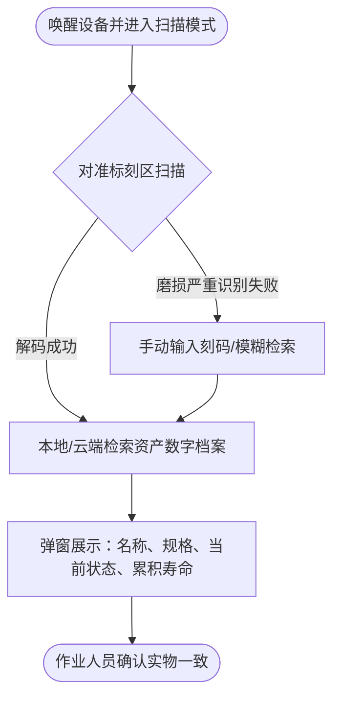
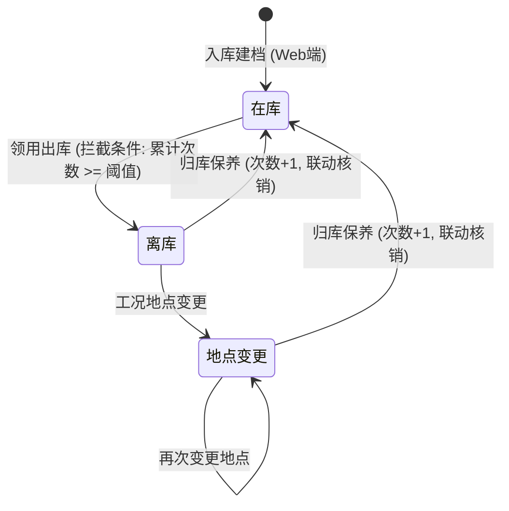
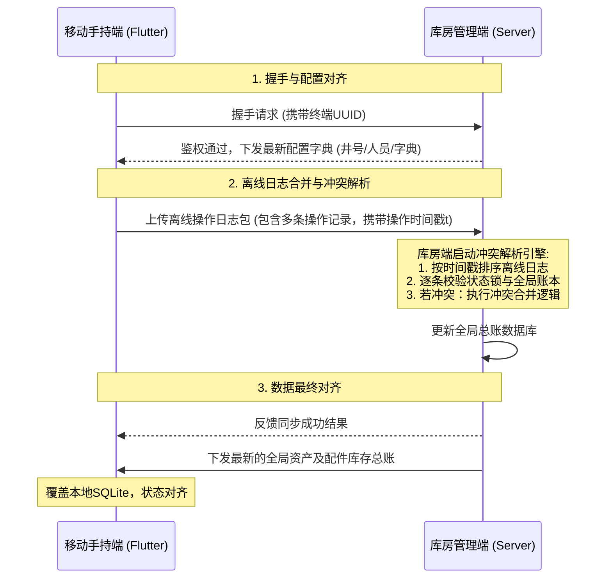
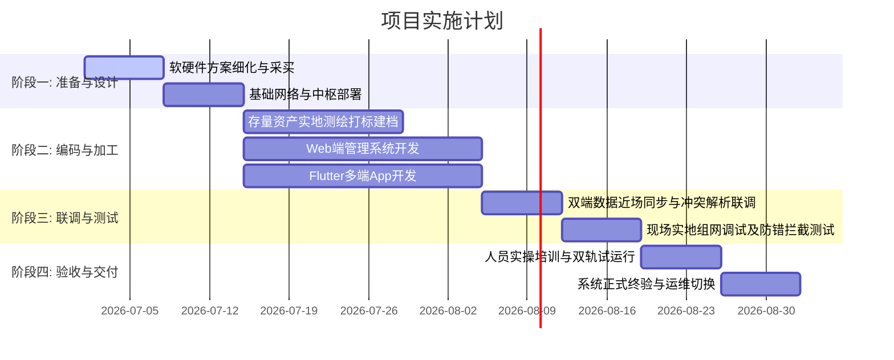

# 精密工具智能化管理系统 产品需求文档 (PRD)

---

## 1. 文档概述

### 1.1 项目背景
在深层与非常规油气开采作业中，井下精密工具（如电动坐封工具、阿瓦隆桥塞等）面临着严苛的工况环境（高温、高压、腐蚀、冲蚀）。由于这些工具的价值高、安全风险大，传统的人工纸质台账和离散记录模式极易导致账实不符、状态滞后、疲劳超期工具带病作业等隐患。
本项目拟建设一套**精密工具智能化管理系统**，通过在物理层面实施浅表级微损打标，结合移动端离线智能视觉识别、边缘状态机管控及近场多终端数据同步技术，实现精密工具“一物一身份、全程追溯、智能预警、安全合规”的全生命周期精细化管控。

### 1.2 建设目标
1. **唯一映射**：建立精密工具“一物一档”的数字资产映射，确保身份标识在严苛工况下的可读性与本体结构安全。
2. **边缘脱机**：支持无网/弱网野外井场环境下的移动端离线识别、防错校验与状态流转拦截。
3. **闭环维保**：实现维保记录自动累加工具使用寿命（次数），并联动核销在库配件库存。
4. **主动防御**：前置拦截寿命临期、出库超期的异常工具，规避井下非计划停工风险。
5. **高效审计**：提供管理驾驶舱进行全局态势感知，支持一键导出标准 Excel 审计报表。

### 1.3 术语与定义
* **精密工具**：指电动坐封工具、阿瓦隆桥塞等高价值、高安全要求的井下核心设备，通过物理刻码绑定唯一身份。
* **耗材配件**：指密封圈、螺栓等维修保养时消耗的易损件，通过三防不干胶标签进行批次或单件标识。
* **离线状态机**：移动端内置的业务逻辑控制器，用于在无网环境下根据工具当前状态限制其下一步的合法操作。
* **近场同步**：多台移动端返回基地库房后，通过专用局域网（Wi-Fi/蓝牙）与主控管理端进行数据对齐的过程。

---

## 2. 系统架构与技术栈

### 2.1 拓扑结构与部署方案
系统采用“前端移动工作台（离线边缘计算）+ 库房总控中枢（集中校验节点）”的混合架构：
1. **库房总控中枢 (Web管理端)**：部署于基地库房服务器，作为系统的主控校验节点和全局数据库底座。
2. **前端移动工作台 (移动App端)**：部署于本安防爆手持终端，作业人员携带至无网络野外井场执行任务。

```mermaid
graph TD
    subgraph 基地库房 (有网环境)
        WebCent[库房总控中枢 Web端]
        DB[(全局总账数据库)]
        Printer[配件标签打印机]
        Marking[精密工具刻码设备]
        WebCent --> DB
    end

    subgraph 野外井场 (无网环境)
        FlutterApp1[移动端App A - 手持终端]
        FlutterApp2[移动端App B - 手持终端]
        SQLite1[(边缘SQLite本地库)]
        SQLite2[(边缘SQLite本地库)]
        FlutterApp1 --> SQLite1
        FlutterApp2 --> SQLite2
    end

    Sync1[近场局域网握手 / 数据同步]
    Sync2[近场局域网握手 / 数据同步]
    FlutterApp1 -.->|回库同步| Sync1 -.-> WebCent
    FlutterApp2 -.->|回库同步| Sync2 -.-> WebCent
```

### 2.2 技术栈选型
为满足“一套代码、多端复用、高可靠离线能力”的要求，技术栈确定如下：
* **移动端 (App/Pad)**：使用 **Flutter** 跨端框架（启用 **Material Design 3** 风格组件）。
  * 数据库：**SQLite** (使用 `sqflite` 插件进行本地持久化，管理边缘状态机与离线数据)。
  * 扫码解析：**mobile_scanner** 库，实现基础的数字编码（二维码/条形码）摄像头识别功能。
* **库房端 (Web)**：前端采用 **Vue3** + **Element Plus** 组件库，后端采用 **Python (Flask/FastAPI)** 或 **Node.js (Express)** 框架，数据库使用 **PostgreSQL** 或 **MySQL**，部署于基地库房局域网服务器。图表渲染使用 **ECharts** 组件。
* **通信协议**：近场同步时采用局域网 HTTP API 或 TCP Socket 协议进行握手和对齐。

---

## 3. 角色与权限模型

为了简化流程并确保业务高效流转，系统不做复杂的 RBAC（基于角色的权限控制）设计，只区分以下两个核心角色：

| 角色名称 | 登录客户端 | 核心职责 | 业务权限范围 |
| :--- | :--- | :--- | :--- |
| **库管员** | 库房专用 Web 端 | 全局资产建档、终端调度授权、配件库存管理、主动预警响应、报表导出审计 | 全局数据读取、新建资产/配件档案、下发运行配置、手动录入与修改、导出 Excel 报表 |
| **作业人员** | 移动端 App | 现场工具扫码识别、出库领用登记、井场地点变更、归库保养与配件核销录入 | 扫码识别、离线录入业务数据（出库、变更、维保）、本地暂存、提交近场同步 |

### 3.1 移动端操作人身份确认与追溯

移动端不做复杂的账号密码认证，但必须确保每次操作都能追溯到具体的**人员姓名**和**所属大队**：

1. **首次启动**：App 强制弹出「身份确认」页面，作业人员从本地字典中选择自己的**姓名**和**所属大队**（字典数据由 Web 端统一下发）。确认后身份信息存储在本地 SQLite 中。
2. **后续启动**：App 自动加载上次确认的身份，首页顶部显示当前操作人姓名与大队标识，无需每次重新选择。
3. **身份切换**：在设置页面中可随时更换当前操作人身份。
4. **操作日志自动关联**：所有离线操作日志（出库、地点变更、维保）自动附带当前操作人姓名及所属大队，同步至 Web 端后可按人员/大队维度进行统计分析与报表导出。

---

## 4. 核心业务场景与流程

### 4.1 工具身份识别场景 (场景一)
* **业务目标**：在仓库盘点或井口确认时，快速辨识工具身份并展示其全生命周期信息。
* **流程图**：


### 4.2 入库建档与初始化场景 (场景二)
* **业务目标**：新购工具或存量工具初次进入系统，实施物理加工与数字绑定。
* **物理加工规范**：
  * **精密工具**：使用便携式气动打标机，在铣槽平面或接头护丝后端（非应力集中区）刻码。刻深度控制在 0.05mm - 0.3mm，具备耐高温（150℃）、耐高压（70MPa）与常态化泥浆耐腐蚀能力。
  * **耗材配件**：使用热敏打印机输出三防不干胶标签（耐磨、防油污），物理粘贴在配件包装上。
* **操作步骤（库房 Web 端完成）**：
  > **注意**：入库建档功能统一在库房 Web 管理端完成，移动端不负责资产建档。Web 端支持单个手动录入和批量 Excel 导入，可管理工具、配件、人员、井口等全部资产字典。
  1. 库管员在 Web 端录入或批量导入品牌、型号等基础参数。
  2. 物理清洁打标区域，执行刻码或贴标。
  3. 库管员在 Web 端建档页面输入或扫码录入编码，关联出厂型号，设定**初始寿命阈值**（如电动坐封工具设为 30 次）。
  4. 建档数据写入全局总账数据库，工具状态初始化为"在库"。移动端通过近场同步获取最新资产数据。

### 4.3 领用出库与离线作业场景 (场景三)
* **业务目标**：记录工具流转动向，利用状态机避免寿命超期工具下井。
* **流程与自检规则**：
  1. 作业人员在移动端选择“领用出库”，扫描工具物理识别码。
  2. **边缘自检（寿命警告）**：系统检索该工具累积使用次数。若**累积使用次数 >= 寿命阈值**，移动端自动拦截，弹出红色高亮警告，禁止出库。
  3. **出库登记**：若状态正常，录入领用人、作业队、目标井号（均从离线字典中拉取）。系统自动带出该品类的**默认归还周期**，作业人员可根据实际任务需要**手动调整预计归还日期**。确认出库后，本地状态变更为"离库"。
  4. **工况地点变更（离线）**：在井场间临时调拨时，再次扫码，选择“地点变更”，输入当前新井号，工具本地状态更新，待回库后统一上传以追溯轨迹。

### 4.4 归库保养与配件核销场景 (场景四)
* **业务目标**：工具完工回库，登记维保内容，累加使用寿命次数（+1），并联动扣减消耗的易损零配件库存。
* **逻辑核心**：
  1. 维保人员扫描工具码，选择“归库保养”。
  2. 线下执行拆解、清洁，更换密封圈等配件。
  3. **配件联动扣减**：在移动端勾选或扫描消耗的配件条码（如“氟橡胶密封圈 O-Ring”），输入消耗数量。本地配件库存相应进行**动态扣减**。
  4. **状态恢复**：提交维保记录，该工具的**使用次数累加 1 次**。
  5. 近场同步后，工具在全局总账中的状态恢复为“在库”，配件全局库存同步减少。

### 4.5 数据监控与报表导出场景 (场景五)
* **业务目标**：管理人员在库房端通过驾驶舱监控全局运行态势，并导出报表用于审计核算。
* **操作步骤**：
  1. 登录 Web 端管理后台，首页直观查看核心 KPI 看板与高亮警告。
  2. 支持数据穿透：输入工具编码，即可追溯“入库-出库-井场地点-维保归库-配件消耗”全周期的操作日志及签名。
  3. 点击导出，生成规范化 Excel 报表。

---

## 5. 功能模块详细设计

### 5.1 库房专用管理端 (Web)

#### 5.1.1 资产数字档案底座
* 建立精密工具"一物一码一档"的数据结构，核心字段包括：工具唯一编码、工具名称、规格型号、序列号、品牌/生产商、涂层信息、采购日期、入库日期、初始寿命阈值、当前累积使用次数、当前状态（在库/离库/地点变更/报废）、当前位置/所属队号、最后更新时间、操作人。
* 提供对存量工具数据的批量导入、编辑与作废功能。
* ~~支持库存盘点功能~~（**暂不实现**，后续版本按需迭代）。

#### 5.1.2 独立配件全生命周期库管
* 配件基础账本：配件条码/编码、配件名称、规格型号、单位、安全库存阈值、当前库存量。
* 支持配件的“独立入库”与手动库存调整。
* **低库存预警**：当当前库存量低于安全库存阈值时，在 Web 端列表及驾驶舱以黄色警示，提醒库管员补货。

#### 5.1.3 终端调度与运行配置
* **设备授权管理**：列出所有可连接的移动端手持设备（按唯一序列号 UUID 识别），库管员可在 Web 端进行“启用/禁用”授权。
* **字典参数集中下发**：维护统一的领用人列表、作业队列表、目标井号列表、维保项目字典，在近场握手时统一推送到移动端。

#### 5.1.4 智能监控与主动预警中心
* **寿命临期预警**：实时展示“剩余使用次数 <= 3 次”或已达到阈值的工具列表。
* **归还超期预警**：基于不同工具品类配置的**默认归还周期**（如电动坐封工具30天），系统对比“出库时间 + 归还周期”与当前时间。若发生超期，该工具在资产列表中红色高亮显示，并推送至预警看板。

#### 5.1.5 驾驶舱与 Excel 报表输出
* **资产可视化看板**：
  * 核心指标卡片：工具总数、在库数、离库数、当前预警数、已锁定工具数、配件总类、在库总量。
  * 工具状态分布图（在库、离库、报废的比例，使用环形图/饼图渲染）。
  * **分队持有量视图**：实时展示基地总库及各井队当前的工具持有量与配件库存量。
  * 预警快捷处理窗口：高亮显示超期未还、寿命临期工具卡片（含使用次数进度、归还周期倒计时），支持一键发起校验或查看详情。
* **Excel 一键导出功能**：
  * **工具资产报表**：包含工具编码、名称、型号、状态、使用次数/寿命阈值、当前位置、最后操作时间。
  * **配件库存报表**：包含配件条码、名称、规格、当前库存、安全水位、累计消耗量。
  * **操作日志报表**：包含操作时间、操作类型、**操作人姓名**、**所属大队**、关联工具编码、操作详情。支持按人员或按大队维度筛选与统计分析。

### 5.2 身份识别录入工具移动端 (Flutter)

#### 5.2.1 摄像头扫码识别
* 借助摄像头调起 `mobile_scanner`，实现基础的数字编码识别功能（支持二维码和条形码），在无网络下完成工具打码区域的解析。
* 识别成功后自动跳转至工具详情与业务操作页面。
* **容错回退**：如识别失败或标刻磨损严重，支持手动输入编码进行本地 SQLite 查询。

#### 5.2.2 参数采集与防错校验
* 录入出库、地点变更或维保数据时，领用人、作业队、井号等字段采用**下拉选择框**（基于已同步的本地字典），防止人员手动拼写错误导致数据混乱。
* 提交保存时，实时校验必填项完整度。

#### 5.2.3 边缘离线状态机管控
* 移动端本地内置状态机控制器，严格按照以下状态迁移图进行合法性校验：



* **逻辑拦截**：如果工具在本地状态为“在库”，移动端禁止用户对其进行“地点变更”或“归库保养”操作；如果本地状态为“离库”，禁止二次重复出库。非法操作将弹出 toast 提示拦截。

#### 5.2.4 维保与配件联动核销
* 维保提交页面除了录入维保级别（一级/二级/大修）外，设有“配件消耗核销”区域。
* 作业人员扫码或选择配件后，输入消耗数量，系统自动执行本地 SQLite 的配件库存扣减。

---

## 6. 双端数据同步与冲突解析规范

由于野外作业处于完全脱机状态，多台移动手持设备可能在不同时间对同一批工具进行离线操作，回库同步时需要解决数据差异冲突。

### 6.1 近场组网与安全通信
1. **握手通道**：手持设备回库后，连接库房内部局域网 Wi-Fi，向 Web 管理端的固定 IP 地址发送同步请求。
2. **鉴权校验**：Web 端校验手持设备的 UUID 与授权状态，通过后建立安全握手通道。

### 6.2 同步时序与逻辑对齐
同步过程遵循“先拉取、后推送、再合并”的时序：



### 6.3 冲突解析合并逻辑 (时间戳优先 + 状态锁校验)
* **状态锁定义**：全局数据库中每个工具资产含有一个唯一的 `Version` 或 `LastUpdateTime` 时间戳锁。
* **冲突判定与处理流程**：
  1. 当移动端同步离线记录时，库房端主控节点将离线记录按照**操作实际发生的时间戳**从早到晚进行排序（时间戳优先）。
  2. 依次“回放”操作。每一步操作前，校验该工具在数据库中的“最后操作状态”与待执行记录的“前置状态”是否吻合。
  3. **冲突案例**：移动端 A 在 `10:00` 对工具 T 执行了出库（变更为离库）；移动端 B 在 `10:15` 在不知道 A 已出库的情况下（因皆处于离线），也扫描了工具 T 并录入出库。
  4. **解析策略**：系统在 `10:00` 回放 A 的记录，工具 T 状态变为离库。在回放 B 的 `10:15` 记录时，判定当前状态已是“离库”，触发状态锁冲突拦截。系统会自动忽略 B 的二次出库操作，并在同步结果报告中提示：“设备 T 已于 10:00 被移动端 A 领用出库，移动端 B 的重复领用记录已忽略”。
  5. 库房端处理完毕后，将最终对齐的资产状态下发，覆盖所有移动端的本地 SQLite，确保双端数据绝对一致。

---

## 7. 界面 UI 设计指南 (Material 3)

为了提供极佳的用户体验，界面 UI 采用现代化的 **Material Design 3** 设计语言，选用深海蓝（#1E3A5F）作为主色调，搭配金色（#C9A227）作为警告/高亮强调。

### 7.1 移动端核心页面布局 (Flutter)

#### 7.1.1 移动端首页 (Home)
* **设计风格**：沉浸式蓝色渐变顶部栏，搭配 MD3 圆角卡片，突出高频功能入口。
* **原型效果图参考**：

* **功能布局**：
  * **顶部标题栏**：显示系统名称“工具智能化管理系统”，右上角用户头像图标，左上角离线模式/电量指示。
  * **核心功能卡片区**：纵向排列两张大卡片——
    * **智能离线扫描**：调起摄像头扫描工具二维码/条形码，进入识别与业务操作流程。
    * **数据同步**：同步本地数据至库房服务器，展示待同步记录数。
  * **设置入口**：AppBar 右侧提供设置图标，进入设置页面（配置同步服务器 IP、终端标识、当前操作人身份切换等）。
  * **身份标识栏**：首页顶部显示当前登录操作人姓名及所属大队（如“当前操作人：张建国 | 川庆钻探一队”），便于现场多人轮换使用时确认身份。

#### 7.1.0 身份确认页 (Identity)
* **触发时机**：App 首次启动或本地无已保存身份时，强制弹出此页面。
* **功能布局**：
  * 下拉选择框：从本地同步字典中选择“操作人姓名”和“所属大队”。
  * 确认按钮：点击后保存身份至本地 SQLite，进入主页。
  * 注：不健密码认证，仅作为身份标识用于操作日志追溯。

#### 7.1.2 工具详情及操作页 (Detail)
* **设计风格**：顶部工具实物照片卡片 + 下方结构化属性列表，MD3 圆角卡片分区。
* **原型效果图参考**：

* **功能布局**：
  * **工具详情卡片（顶部）**：展示工具实物照片、工具名称（如“电动坐封工具”）、唯一ID编号（如“TL-MT-056-K”）。
  * **基本属性区**：以列表形式展示——在库状态（绿色高亮）、品牌、型号、涂层、采购日期等核心档案信息。
  * **操作入口（底部按钮组）**：根据工具当前状态，动态显示可执行的操作按钮（如“领用出库”、“归库保养”等），点击后跳转至对应业务表单页面。业务表单中，领用人、作业队、目标井号等字段采用下拉选择框（基于离线字典）。

#### 7.1.3 维保归库与核销页 (Maintenance)
* **原型效果图参考**：

* **功能布局**：
  * **维保配置**：单选按钮组（一级保养/二级保养/大修）。
  * **配件消耗列表**：以列表形式呈现已添加的配件卡片。支持点击“扫码消耗”按钮，直接扫描配件三防标签进行添加，并动态增减数量。

#### 7.1.4 数据同步控制台 (Sync)
* **原型效果图参考**：

* **功能布局**：
  * 显示当前未同步的本地离线记录条数（如“有 5 条离线业务等待同步”）。
  * 显示近场 Wi-Fi 的连接状态（是否成功连入库房局域网）。
  * 提供一键同步按钮，点击后展示带有圆圈动画的进度条，展示冲突解析合并进度，最终提示“同步成功，本地账本已对齐”。

### 7.2 库房端核心页面布局 (Web)

#### 7.2.1 监控驾驶舱 (Dashboard)
* **原型效果图参考**：

* **布局规范**：
  * **左侧导航栏**：固定侧边栏，包含首页、监控、消息、我的等导航入口。
  * **顶部 KPI 卡片区**：大号粗体展示“当前预警数”与“已锁定工具”等核心运营数据。
  * **工具状态卡片矩阵**：以卡片网格形式展示各工具的实时状态。每张卡片包含：工具实物照片、编号、当前状态标签（运行中/保养中/待用等不同颜色）、使用次数进度条（如 28/30）、归还周期倒计时（如“剩余 5 天/一个月”）、异常标记（如“次数临界”、“保养中-违规操作锁定”）以及操作按钮（发起校验/出库/查看详情/出库申领）。

#### 7.2.2 工具生命周期管理 (Lifecycle)
* **原型效果图参考**：

* **布局规范**：
  * 搜索过滤栏：支持按状态、井号、归属队号、寿命水位进行多条件组合查询。
  * 列表采用扁平表格，工具状态列含状态标签（如“在库”为绿色标签，“超期”为红色闪烁标签）。
  * 点击任意一行可穿透至详情抽屉（Drawer），在抽屉中以时间轴（Timeline）形式生动展示该工具从“首次建档入库 -> 历次领用出库 -> 井场变更 -> 历次维保配件消耗”的完整追溯链条。

---

## 8. 开发与实施计划

系统建设周期预计为 **9 周**，划分为四个阶段实施：



### 8.1 阶段 1：启动准备与系统设计（W1 - W2）
* **W1（需求细化与硬件采买）**：
  * 细化刻码设备底座工装基座适配方案，采购热敏打印机、防爆手持终端（满足 IP54 - IP65 级防护）。
  * 细化双端同步数据库表结构及接口契约。
* **W2（基础部署）**：
  * 搭建库房端服务器局域网环境，配置 Web 系统运行底座。
  * 现场打标加工设备通电调试，调整打标头频段参数。

### 8.2 阶段 2：数字化加工与软件编码（W3 - W5）
* **W3 - W4（存量资产测绘与物理打标）**：
  * 现场对存量电动坐封工具、桥塞以及库房零配件进行测绘，采集原始台账。
  * 完成精密工具的物理刻码加工与三防贴标，完成首批资产的数据建档。
* **W3 - W5（软件研发）**：
  * **Web端**：开发资产数字档案、配件库管、库存盘点任务管理、终端调度配置、预警引擎、ECharts 监控驾驶舱与 Excel 报表导出。
  * **Flutter端**：开发摄像头智能扫码模块、本地 SQLite 存储、离线状态机控制器、库存盘点扫码核对、地点变更以及维保配件核销页面。

### 8.3 阶段 3：系统集成联调与防错测试（W6 - W7）
* **W6（双端接口联调与近场同步测试）**：
  * 联调多手持端连接局域网 Wi-Fi 与库房 Web 端的近场同步逻辑，实测“时间戳优先 + 状态锁校验”冲突合并算法。
  * 测试数据包丢包重传与本地 SQLite 数据库状态重置。
* **W7（现场防错与防爆测试）**：
  * 在模拟弱网/断网环境下，测试状态机对非合规流转（如在库工具直接进行维保）的拦截率。
  * 现场实测磨损条码的手动模糊检索功能。

### 8.4 阶段 4：试运行、培训与验收交付（W8 - W9）
* **W8（试运行与培训）**：
  * 对库管人员及现场作业队人员进行系统操作培训。
  * 双端系统上线进行“纸质台账+智能系统”双轨试运行，验证维保与配件联动核销数据一致性。
* **W9（项目终验）**：
  * 整理输出《项目集成测试报告》、《操作使用手册》、《系统验收报告》。
  * 交付打标硬件装备、防爆终端及双端系统源代码，项目正式切换至运维托管状态。
